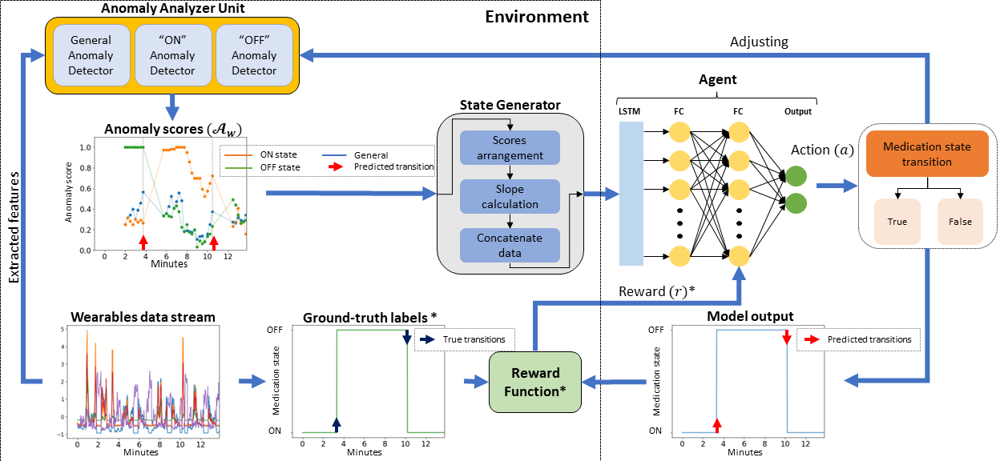
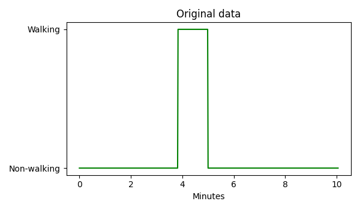
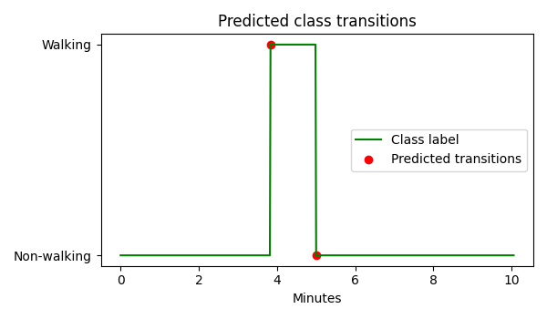
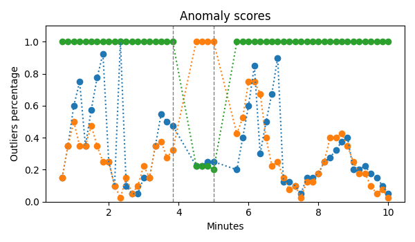

# Deep Reinforcement Learning Based Adaptive Classifier
This is a unique approach using Reinforcement Learning (RL) to discern shifts in data stream distributions during state transitions.
Training an RL agent to recognize these transitions makes it adept at identifying transitions in new data.
Instead of static models, our agent interacts with the data's dynamics and makes optimal classification decisions.
This RL-driven framework prioritizes understanding changes in data distribution, making it robust against inter and intra-data variations.

## Updates
More updates regarding the description are coming soon. I will also update the code to make it more generalizable.

## Deep Reinforcement Learning Adaptive Classification of PD Medication State

**Figure 1.** The proposed reinforcement learning-based adaptive classification framework.

		 
**Figure 2.** The model prediction for Walking vs. Non-walking in one particiapnt of the MHEALTH dataset.

- Preliminary results of this project were published at the IEEE ICDM 2022 Conference.
- Incremental Learning in Time-series Data using Reinforcement Learning: https://doi.org/10.1109/ICDMW58026.2022.00115
- An extensive extension of this work has been recently accepted at the IEEE Journal of Biomedical and Health Informatics.

## Code Requirements and Compatability
The code was run and tested using the following:
- Python			3.8.10
- tensorflow		2.8.4
- keras				2.8.0
- h5py				3.10.0
- matplotlib		3.6.3
- numpy				1.20.3
- pandas			1.3.4
- scikit-learn		1.3.2
- scikit-multiflow	0.5.3

## Conclusions

